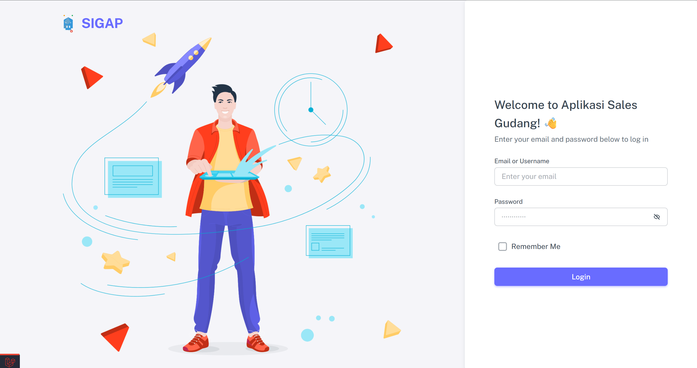
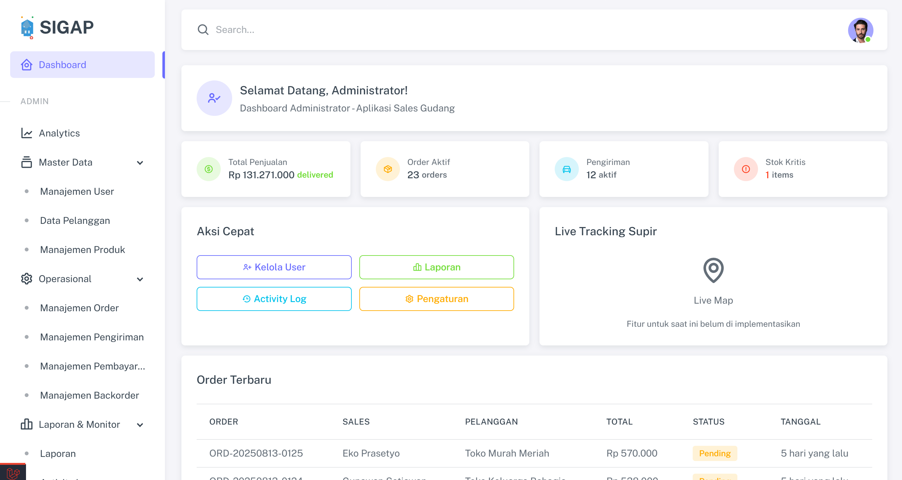
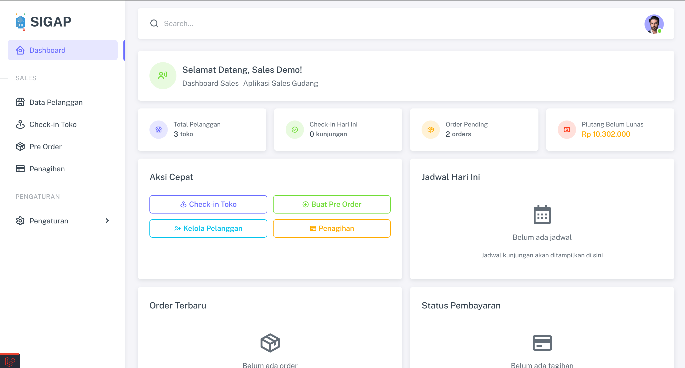
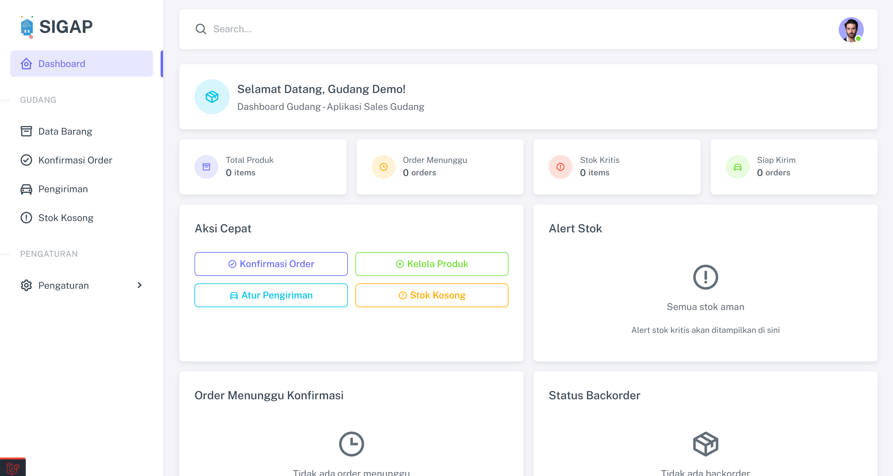
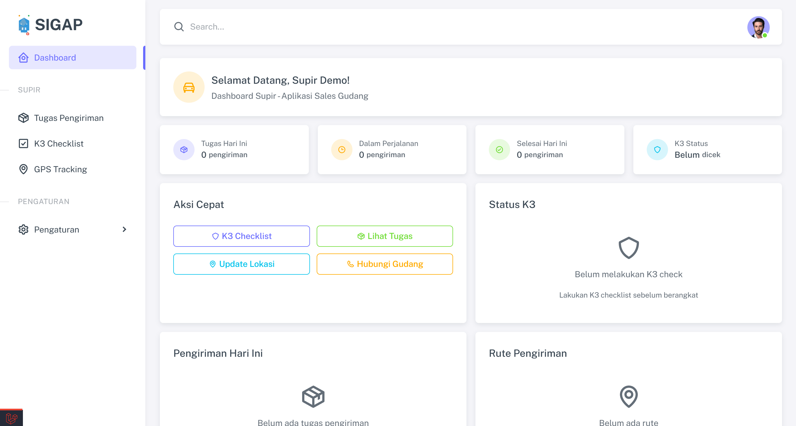

# 🚀 SIGAP Laravel - Sistem Informasi Gudang dan Penjualan

<div align="center">
  <p><strong>Sistem digital komprehensif untuk mengelola proses operasional bisnis mulai dari pemesanan oleh Sales, manajemen stok Gudang, pengiriman Supir, hingga pengawasan menyeluruh oleh Admin.</strong></p>

  
  
  
  
</div>

## 📋 Table of Contents

- [Screenshots](#-screenshots)
- [Fitur Utama](#-fitur-utama)
- [Tech Stack](#-tech-stack)
- [Instalasi](#-instalasi)
- [Default User Credentials](#default-user-credentials)
- [Workflow System](#-workflow-system)
- [Deployment](#-deployment)
- [Contributing](#-contributing)
- [Support](#-support)

## 💻 Tech Stack

- **Backend**: Laravel 12
- **Frontend**: Livewire & Volt
- **Database**: MySQL
- **Styling**: Bootstrap 5
- **Icons**: Boxicons
- **Charts**: Chart.js
- **Maps**: Leaflet/Google Maps
- **File Upload**: Spatie Media Library

## Screenshots

### 🔐 Login System
<div align="center">
  
  <p><em>Secure login system dengan role-based authentication</em></p>
</div>

### 📊 Dashboard Overview

#### Admin Dashboard
<div align="center">
  
  <p><em>Comprehensive admin dashboard dengan monitoring menyeluruh</em></p>
</div>

#### Sales Dashboard
<div align="center">
  
  <p><em>Sales dashboard untuk order management dan customer check-in</em></p>
</div>

#### Gudang Dashboard
<div align="center">
  
  <p><em>Warehouse management dengan inventory control dan delivery assignment</em></p>
</div>

#### Supir Dashboard
<div align="center">
  
  <p><em>Driver dashboard dengan GPS tracking dan K3 checklist system</em></p>
</div>

---

## Fitur Utama

### 🔐 Role-Based Access Control
- **Admin**: Dashboard monitoring, user management, reporting
- **Sales**: Pre-order, check-in toko, penagihan
- **Gudang**: Manajemen stok, konfirmasi order, kontrol pengiriman
- **Supir**: Tracking pengiriman, GPS coordination

### 📊 Dashboard & Monitoring
- Real-time sales tracking
- Live GPS tracking supir
- Stok alert & inventory management
- Comprehensive activity logs

### 🚚 Order Management
- End-to-end order processing
- Automated backorder handling
- Status tracking real-time
- GPS-based delivery confirmation

### 📱 Mobile-Responsive Design
- Optimized untuk penggunaan mobile di lapangan
- Touch-friendly interface untuk semua role
- Responsive tables dengan mobile cards view
- GPS dan camera integration untuk mobile devices

### 🛡️ K3 Safety System
- Comprehensive safety checklist untuk supir
- Vehicle inspection sebelum pengiriman
- Photo documentation untuk compliance
- Real-time safety monitoring

### 🗺️ GPS & Location Services
- Real-time GPS tracking untuk delivery
- Location-based check-in system
- Route optimization dan monitoring
- Geofencing untuk delivery confirmation

## 🛠️ Instalasi

### Prerequisites
- PHP 8.2+
- Composer
- MySQL 8.0+
- Node.js & NPM

### Setup

```bash
# Clone repository
git clone https://github.com/prassaaa/sigap-laravel.git
cd sigap-laravel

# Install dependencies
composer install
npm install

# Environment setup
cp .env.example .env
php artisan key:generate

# Database setup
php artisan migrate
php artisan db:seed

# Build assets
npm run build

# Start server
php artisan serve
```

### Default User Credentials

Setelah menjalankan seeder, Anda dapat login dengan kredensial berikut:

| Role | Email | Password |
|------|-------|----------|
| **Admin** | admin@sigap.com | password |
| **Sales** | sales@sigap.com | password |
| **Gudang** | gudang@sigap.com | password |
| **Supir** | supir@sigap.com | password |

> **⚠️ Penting**: Ubah password default setelah login pertama kali untuk keamanan.

### Konfigurasi Database

```sql
CREATE DATABASE sigap_laravel;
```

Update `.env`:
```env
DB_CONNECTION=mysql
DB_HOST=127.0.0.1
DB_PORT=3306
DB_DATABASE=sigap_laravel
DB_USERNAME=root
DB_PASSWORD=
```

## 🔄 Workflow System

### 1. Order Creation Flow
```
Sales Check-in → Input Pre Order → Gudang Confirmation → Ready for Delivery
```

### 2. Delivery Flow
```
Gudang Assign Driver → K3 Checklist → Process Delivery → GPS Confirmation → Delivered
```

### 3. Payment Flow
```
Delivery Confirmed → Sales Create Invoice → Payment Processing → Status Update
```

## 🚀 Deployment

### Production Setup

```bash
# Optimize autoloader
composer install --optimize-autoloader --no-dev

# Cache configurations
php artisan config:cache
php artisan route:cache
php artisan view:cache
php artisan livewire:clear-cache
php artisan view:clear

# Build production assets
npm run production

# Set permissions
chmod -R 755 storage/
chmod -R 755 bootstrap/cache/
```

## 🤝 Contributing

1. Fork the repository
2. Create feature branch (`git checkout -b feature/AmazingFeature`)
3. Commit changes (`git commit -m 'Add some AmazingFeature'`)
4. Push to branch (`git push origin feature/AmazingFeature`)
5. Open a Pull Request

## License

This project is licensed under the MIT License - see the [LICENSE](LICENSE) file for details.

## 📞 Support

Untuk support dan pertanyaan:
- 📧 Email: support@sigap.com
- 📱 WhatsApp: +6289696673806
- 🐛 Issues: [GitHub Issues](https://github.com/prassaaa/sigap-laravel/issues)

---

<div align="center">
  <p><strong>SIGAP Laravel</strong> - Sistem Informasi Gudang dan Penjualan</p>
  <p>Built with ❤️ using Laravel & Livewire</p>
</div>
